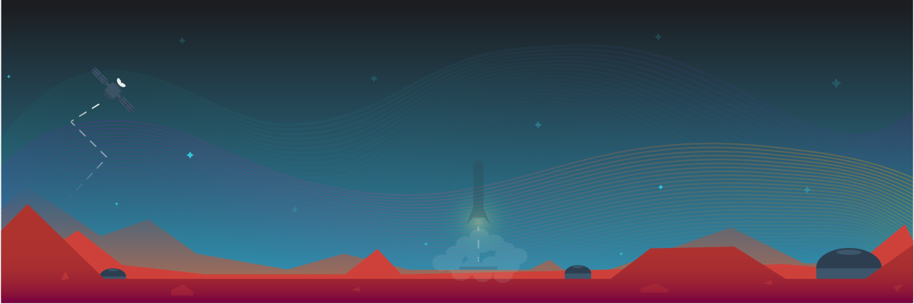

# [Eid Systems](http://www.eid.systems)



This is my personal full stack website developed from the ground up. Node.js, Express, and MongoDB were used for the back-end while React and Redux were used for the front-end. The site is mobile accessible via media queries.

#### Implementation Architecture

The entirety of the application, including the compiled CSS from SASS, is run using a single JavaScript file. This minified script is built using Webpack and Babble which conglomerate the myriad of source files into a single entity. The application data used throughout the site is retrieved from the back-end express server hosted using Node.js via Redux. This data is placed into a store which is then utilized by the React components making up the foundation of the front-end. No styling libraries were used. All animations were performed via CSS3 with the help of React.

## Prerequisites

* [Node.js](https://nodejs.org/en/) (>= v6.11.0)

## Usage

To build assets using webpack, run the build-prod script using npm.

```bash
npm run build-prod
```

To launch a production server, invoke the start-prod script using npm.

```bash
npm run start-prod
```

To start a development server making use of Webpack middleware, run start-dev using npm.

```bash
npm run start-dev
```
